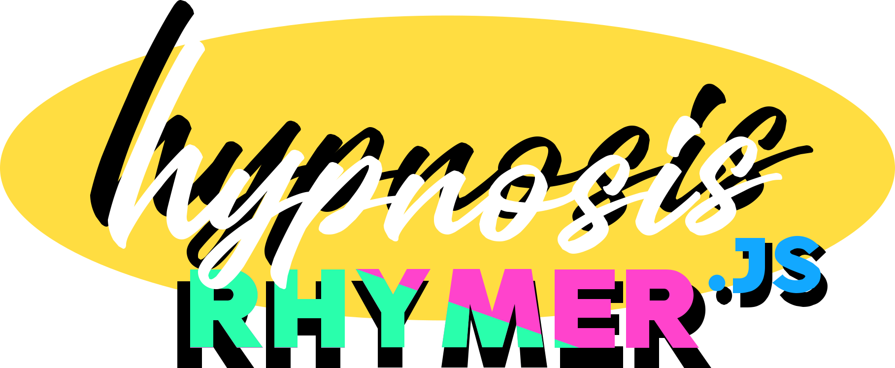

# Hello!
hypnosisRhymer.jsは、ブラウザでライムを踏みたいRapperのために制作されたクールなライブラリです。ブラウザがあれば誰でも操作でき、お手持ちのWebサイトにも簡単に導入できます。自分のリリックとアニメーションを定義して、オリジナルのPVを作ることもできます。 

# hypnosisRhymer.jsの利用について
MITライセンスに基づき、このソースコードをOSSとして公開します。ライセンスが定める条件は以下の通りです。
> hypnosisRhymer.jsは、コピー利用、配布、変更の追加、変更を加えたもの再配布、商用利用、有料販売など、自由にお使いいただくことができます。 
> ただし、このソフトウェアの著作権表示 
>> ( ©︎ copyright 2021 n2-freevas / Released under the MIT license / ) 
>
> と、このライセンスの全文を、ソースコードや、ソースコードに同梱したライセンス表示用の別ファイルなどに掲載してください。掲載のない利用を発見した場合には担当の者から指摘をさせていただきますので予めご了承ください。 
>このソフトウェアには保証はついていません。
このソフトウェアを利用したことで問題が起きた際に、ソフトウェアの製作者は一切の責任を負いません。

# Quick Start (クイックスタート)
重厚な説明書よりまずはQuickStart、頭上にセンセーションそれはTwink-Star 
Quick Startとは、プログラマー用語で、「手っ取り早くプログラムを動かしたい」という人のための簡易説明書です。

## とりあえず触ってみたい
リンク
<!--　リンクを挿入　-->

## 歌詞を作りたい

## インポート

<!-- @import "[TOC]" {cmd="toc" depthFrom=1 depthTo=6 orderedList=false} -->
## 
