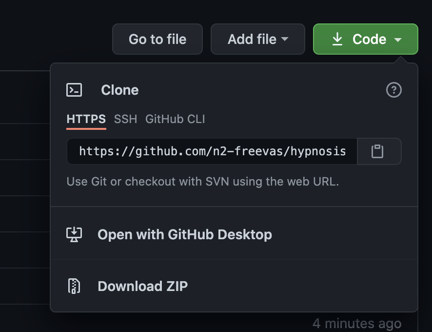
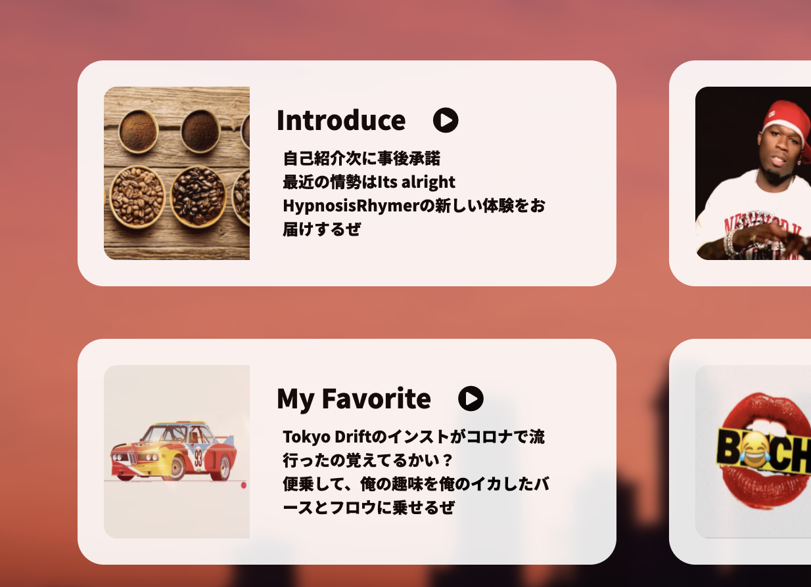
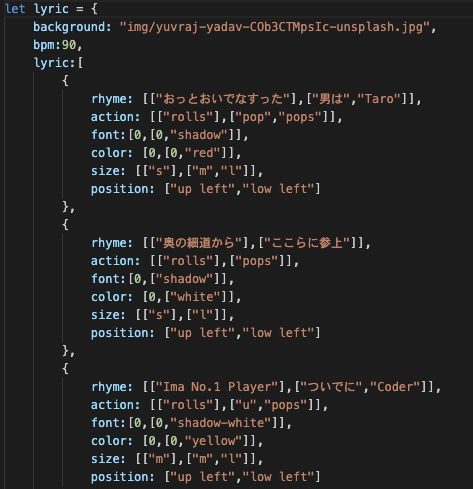

# Hello! (Ver 0.β)
hypnosisRhymer.jsは、ブラウザでライムを踏みたいRapperのために制作されたCoolなライブラリです。ブラウザがあれば誰でも操作でき、必要によってはお手持ちのWebサイトにも簡単に導入できます。自分のリリックとアニメーションを定義して、オリジナルのPVを作ることもできます。 

<!-- @import "[TOC]" {cmd="toc" depthFrom=1 depthTo=6 orderedList=false} -->

- [Hello! (Ver 0.β)](#hello-ver-0β)
- [hypnosisRhymer.jsの利用について](#hypnosisrhymerjsの利用について)
- [Quick Start (クイックスタート)](#quick-start-クイックスタート)
  - [<とりあえずインストールして、プレイ>](#とりあえずインストールしてプレイ)
  - [<使用シチュエーション例>](#使用シチュエーション例)
- [より使いこなしたい](#より使いこなしたい)
  - [<歌詞を作りたい>](#歌詞を作りたい)
  - [<もっとアニメーションを増やしたい>](#もっとアニメーションを増やしたい)
  - [<その他>](#その他)

# hypnosisRhymer.jsの利用について
MITライセンスに基づき、このソースコードをOSSとして公開します。ライセンスが定める条件は以下の通りです。
> hypnosisRhymer.jsは、コピー利用、配布、変更の追加、変更を加えたもの再配布、商用利用、有料販売など、自由にお使いいただくことができます。 
> ただし、このソフトウェアの著作権表示 
>> ( ©︎ copyright 2021 n2-freevas / Released under the MIT license / https://github.com/n2-freevas/hypnosisRhymer/tree/master ) 
>
> と、このライセンスの全文を、ソースコードや、ソースコードに同梱したライセンス表示用の別ファイルなどに掲載してください。掲載のない利用を発見した場合には担当の者から指摘をさせていただきますので予めご了承ください。 
>このソフトウェアには保証はついていません。
このソフトウェアを利用したことで問題が起きた際に、ソフトウェアの製作者は一切の責任を負いません。

# Quick Start (クイックスタート)
重厚な説明書よりまずはQuickStart、頭上にセンセーションそれはTwink-Star！ 
Quick Startとはプログラマー用語で、「手っ取り早くプログラムを動かしたい」という人のための簡易説明書です。

## <とりあえずインストールして、プレイ>
> テストプレイだけしたい場合は、 https://n2-freevas.github.io/hypnosisRhymer/sample.html にアクセスしてください。

> 実際に自分の歌詞を作ったりして遊びたい場合は、以下の方法でインストールしてください。

1. 緑色の「Code」を押した先、「Download ZIP」からファイルをインストール

2. インストールしたデータを解答する。
3. sample.htmlをブラウザで開く (ダブルクリックなどで開きます。)
4. 事前に用意したデータがあるので、それをプレイしてみよう。

5. Enterキーを押すたびに、リリックが表示されます。
6. カメラの使用を許可すると、PCのカメラの映像が背景として表示されます。 

## <使用シチュエーション例>
hypnosisRhymer.jsは、Web配信などで利用することを想定とする他、ブラウザで動作するので、Chromeやsafariなどの画面を写せるデバイス上であればどこでも動作します！ 
Youtubeで使ったり、ライブ中のバックスクリーンに表示したり、ホームパーティやサークルイベントで使ったりな・・・ 

# より使いこなしたい

## <歌詞を作りたい>
歌詞データの作り方は少し特殊ですが、非常に多彩なエンタメを提供します。 
jsonファイルという下図のようなデータを新規作成・もしくは編集して扱います。詳しい説明は、wiki(https://github.com/n2-freevas/hypnosisRhymer/wiki)をご覧ください！頑張って覚えれば、きっと素晴らしい体験に結びつくでしょう！ 

## <もっとアニメーションを増やしたい>
この要望はかなり難しい！アニメーションはほぼ全てがCSSでコーディングされているので、アニメーションを増やしたいなら新しくCSSを定義しないといけないです！ 
このプログラムはOSSにしたので、githubを使ってPullRequestを送ってくれれば、アニメーションを採用するかもしれないぞ！

<!-- @import "[TOC]" {cmd="toc" depthFrom=1 depthTo=6 orderedList=false} -->
## <その他>
コラボレータは順次募集しています！ 
この最高にCoolなツールで、Hiphopを盛り上げてくれよな！
